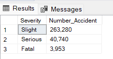
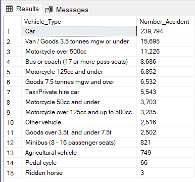
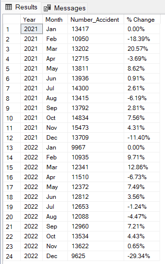
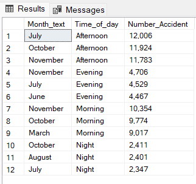
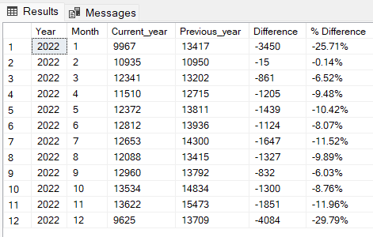
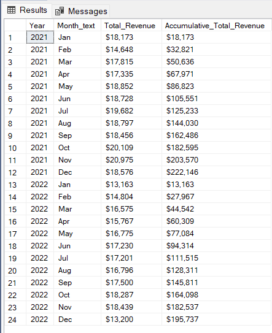
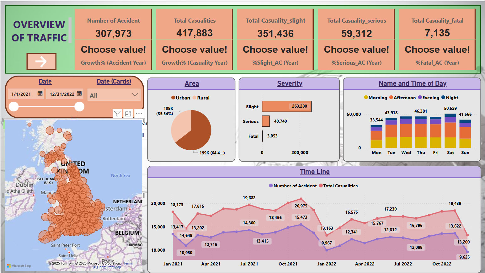
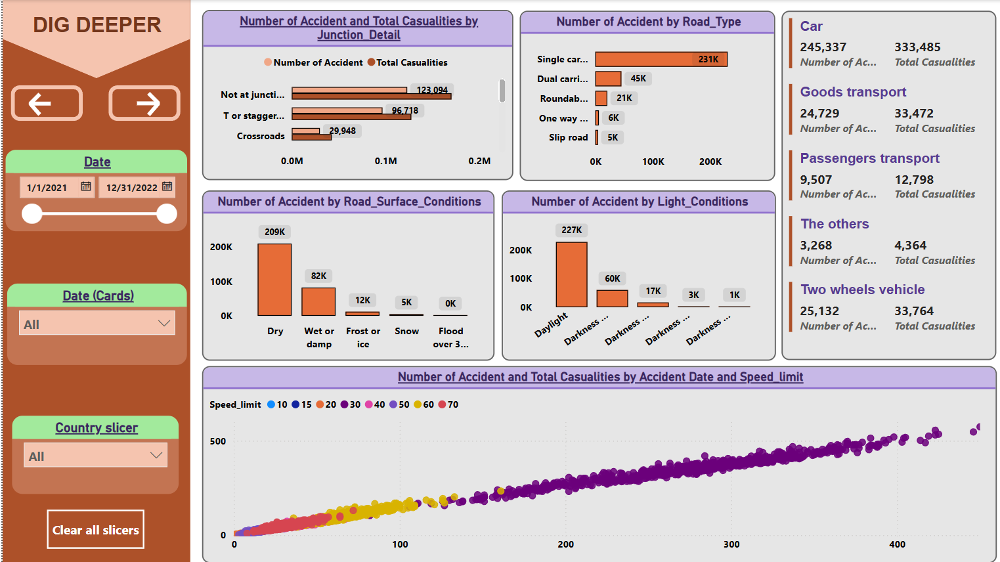
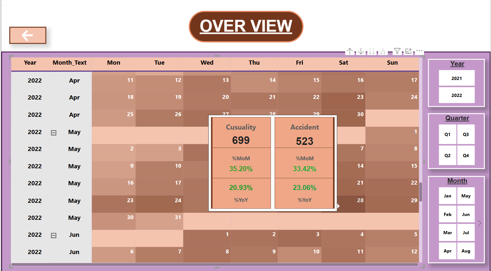

# Road Accident Analysis (Phân tích tình hình vụ va chạm giao thông)

## Introduction (Giới thiệu) 📚

Nhằm mục đích để phân tích 📊 dữ liệu những vụ va chạm giao thông ở nước Anh. Quan đó giúp chúng ta hiểu được phần nào về số vụ tai nạn giao thông ở đất nước trên

## Problems (Vấn đề) ⁉️

### **Những vấn đề (yêu cầu) 🔍 về việc phân tích hoạt động kinh doanh của quán:**

1. Tìm ra tổng số vụ va chạm theo mức độ nghiêm trọng.
2. Tính số lượng vụ va chạm tính theo lượng phương tiện giao thông
3. Tính phần trăm thay đổi trong số vụ va chạm so với tháng liên trước đó
4. Xác định TOP 3 loại phương tiên giao thông có số lượng va chạm nhiều nhất theo từng khung thời gian trong ngày
5. Tính lũy kế cộng dồn số vụ va chạm theo thời gian
6. Xác định sự tăng hoặc giảm số lượng vụ va chạm của năm hiện tại (2022) so với năm trước đó (2021)

## Tool I Used (Những công cụ sử dụng trong bài phân tích này) 🛠️

- **SQL Server:** Dùng để truy vấn (query)

- **Power BI:** Trực quan hóa dữ liệu thông qua dữ liệu bằng bảng, biểu đồ thông qua file truy vấn 

- **Github:** Đăng những câu truy vấn, file dữ liệu cũng như file trực quan hóa dữ liệu để chia sẻ cho mọi người và bài phân tích của cá nhân tôi. Để mọi người có thể tham khảo cũng như đóng góp ý kiến cho tôi

## The Analysis (Phân tích) 📈

1. Tìm ra tổng số vụ va chạm theo mức độ nghiêm trọng
```sql
SELECT
  Accident_Severity Severity,
  FORMAT(COUNT(Accident_Index),'N0') Number_Accident
FROM Accident_data
GROUP BY Accident_Severity
ORDER BY COUNT(Accident_Index) DESC;
```


2. Tính số lượng vụ va chạm tính theo lượng phương tiện giao thông
```sql
SELECT
  Vehicle_Type,
  FORMAT(COUNT(Accident_Index),'N0') Number_Accident
FROM Accident_data
GROUP BY Vehicle_Type
ORDER BY COUNT(Accident_Index) DESC;
```


3. Tính phần trăm thay đổi trong số vụ va chạm so với tháng liên trước đó
```sql
WITH Table1 as
  (SELECT 
    YEAR([accident date]) Year,
    MONTH([accident date]) Month,
    FORMAT([accident date], 'MMM') Month_text,
    COUNT(accident_index) Cur_Number_accident,
    LAG(COUNT(accident_index)) OVER (PARTITION BY YEAR([accident date]) ORDER BY MONTH([accident date]) ASC) Pre_Number_accident
  FROM accident_data
  GROUP BY Year([accident date]), Month([accident date]), FORMAT([accident date], 'MMM')
  )
------
SELECT 
  Year, Month_text as Month,
  Cur_Number_accident Number_Accident,
  FORMAT(ISNULL((Cur_Number_accident - Pre_Number_accident)/ CAST(Pre_Number_accident as DECIMAL(10,2)),0),'P2') '% Change'
FROM Table1;
```


4. Xác định TOP 3 loại phương tiên giao thông có số lượng va chạm nhiều nhất theo từng khung thời gian trong ngày
```sql
WITH Table1 as
  (SELECT 
    MONTH([Accident Date]) Month_Num,
    DATENAME(MONTH, [Accident Date]) Month_text,
    Time_of_day,
    FORMAT(COUNT(Accident_Index), 'N0') Number_Accident,
    RANK() OVER (PARTITION BY Time_of_day ORDER BY COUNT(Accident_Index) DESC) Rank
  FROM Accident_data
  GROUP BY MONTH([Accident Date]), Time_of_day, DATENAME(MONTH, [Accident Date]))
------
SELECT
  Month_text,
  Time_of_day,
  Number_Accident
FROM Table1
WHERE Rank <= 3
```


5. Tính lũy kế cộng dồn số vụ va chạm theo thời gian
```sql
WITH Table1 as
  (SELECT 
    Year([accident date]) Year,
    Month([accident date]) Month,
    FORMAT([accident date], 'MMM') Month_text,
    COUNT(accident_index) Number_accident
  FROM accident_data  
  GROUP BY Year([accident date]), MONTH([accident date]), FORMAT([accident date], 'MMM'))
------
SELECT 
  cur.Year, 
  cur.Month,
  cur.Number_accident Current_year,
  pre.Number_accident Previous_year,
  cur.Number_accident - pre.Number_accident Difference,
  FORMAT((cur.Number_accident - pre.Number_accident)/CAST(pre.Number_accident as DECIMAL(10,2)),'P2') '% Difference'
FROM Table1 as cur
JOIN Table1 as pre ON cur.year = pre.Year + 1  AND cur.Month = pre.Month
ORDER BY Year ASC, Month ASC
```


6. Xác định sự tăng hoặc giảm số lượng vụ va chạm của năm hiện tại (2022) so với năm trước đó (2021)
```sql
WITH table1 as
  (SELECT 
    YEAR([Accident Date]) Year,
    FORMAT([accident date],'MMM') Month_text,
    MONTH([accident date]) Month,
    SUM(Number_of_Casualties) Total
  FROM Accident_data
  GROUP BY YEAR([accident date]), FORMAT([accident date], 'MMM'), MONTH([accident date]))
------
SELECT 
  Year, Month_text,
  FORMAT(Total,'C0') Total_Revenue,
  FORMAT(SUM(total) OVER (PARTITION BY YEAR ORDER BY year ASC, month ASC),'C0') Accumulative_Total_Revenue
FROM table1 
```


## Conclusion (Kết luận) 📝

### **Tổng quan** 
Thời gian thu thập số liệu từ đầu năm 2021 cho đến hết năm 2022.
Tổng quan về tổng số lượng tai nạn trong năm giai đoạn trên đạt khoảng 307,973 nghìn vụ và tổng số người thương vong đạt 417,883 nghìn người. Nếu so trong năm 2022 với năm liền trước đó là năm 2021, có ghi nhận sự sụt giảm cả về số vụ tai nạn giao thông (-11.70%) và số người thương vong (-11.89%).
Xét cụ thể từng trường hợp theo mức độ nghiêm trọng của vụ tai nạn thì gồm 3 loại. Loại 1 là thuộc loại tai nạn va chạm nhẹ với tổng số vụ đạt 263,280 và có tổng cộng 351,436 người thương vong. Tiếp đến là loại tai nạn nghiêm trọng với tổng 40,740 vụ và có 59,312 người thương vong, và cuối cùng là đặc biệt nghiêm trong với 3,953 vụ và có 7,135 người bị tương vong. Nhưng nếu so sánh năm 2022 với năm trước đó thì phần các vụ tai nạn và thương vong đều có sự sụt giảm đang kể. Cụ thể, Trường hợp va chạm nhẹ đạt 165,837 trường hợp (- 10.56%), trường hợp nghiêm trọng ghi nhận con số là 27,045 (-16.18%) và cuối cùng là trường hợp đặc biệt nghiêm trọng đạt 2,855 trường hợp (-33.29%).
Xét theo khu vực, giữa khu vực thành thị và khu vực nông thôn thì dễ dàng nhìn thấy đa số các vụ tai nạn là xảy ra tại khu vực thành khi có khoảng gần 299 nghìn ca (chiếm 64.6%), trong khi đó số vụ tai nan tại khu vực nông thôn đạt hơn 109 nghìn ca (chiếm khoảng 35.54%).
Xét về riêng lẻ các khu vực tại nước Anh thì thành phố Birmingham hiện đang là nơi xảy ra nhiều vụ tai nạn giao thông nhất, ghi nhận đạt 6,165 vụ, tiếp đó là thành phố Leeds ghi nhận có 4,410 vụ tai nạn, và cuối cùng trong top 3 là thành phố Machester với 3,132 vụ việc.
Và xét theo khung thời gian các ngày trong tuần và thời gian trong ngày thì chúng ta thấy đối với thời gian các ngày trong tuần thì tổng quan ngày có vụ tai nạn xảy ra nhiều nhất là vào ngày thứ Bảy. Về khung thời gian trong ngày thì thương tai nạn hay xảy ra nhiều và buổi trưa và chiều, tối.
Theo dòng thời gian thì trong năm 2021 thì ta có thể thấy thông qua biểu đồ thì có sự gia tăng số vụ tai nạn cũng như thương vong từ cuối Quý 3 cho đến đầu Quý 4 (tháng Mười) và đó cũng là cột mốc đạt đỉnh của số vụ tai nạn (15,473 vụ) và số lượng người thương vong (20,975 người). Sau đó có sự sụt giảm trong 2 tháng cuối năm cho đến tháng 1/2022 (số vụ tai nạn giảm 59.3%, số lượng người thương vong giảm 55.2%). Và trong sau đó trong năm 2022 lại có sự gia tăng nhưng như đã biết sự gia tăng này nếu so sánh với năm trước đó thì là không đang kể. Số vụ tai nạn và thương vong tăng trong các tháng còn lại với lực tăng không quá mạnh, nhanh trước khi lại ghi nhận sụt giảm trong cuối năm vào tháng 12/2022.

## [Một số hình ảnh trực quan hóa từ file Power BI](https://github.com/HuyNguyen255/Road-Accident/blob/d091aff509553a8e625e28d0153caf60820ddf1a/Road%20Accident%20Dashboard.pbix)






